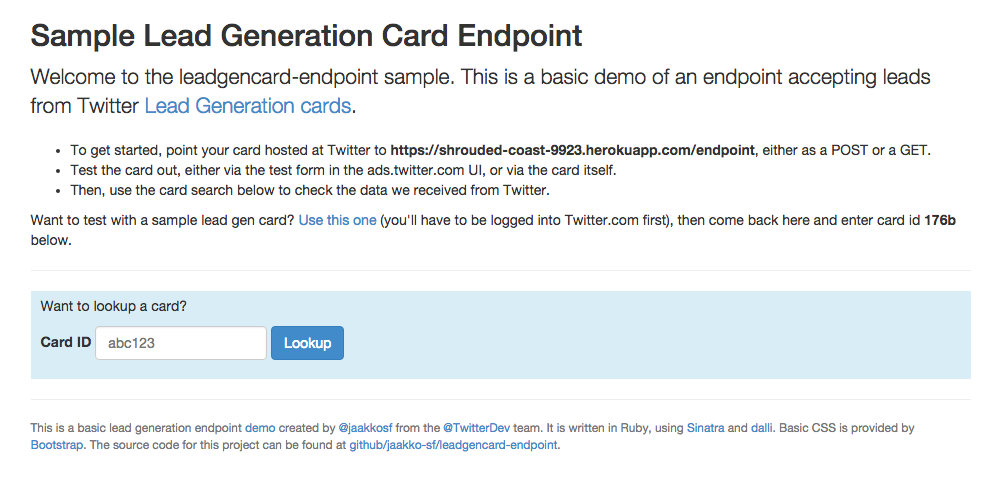

Example Lead Gen Card Endpoint
====================

This is a sample Ruby sinatra app for Twitter lead generation card endpoints.

As always, when developing on top of the Twitter platform, you must abide by the [Developer Agreement & Policy](https://dev.twitter.com/overview/terms/agreement-and-policy). 

Requirements
---------------

On Heroku, this code sample requires [Memcached Cloud](https://devcenter.heroku.com/articles/memcachedcloud) for the cache. You can install
it using the following command:

	`heroku addons:create memcachedcloud`

Alternatively, the Heroku configuration is already available in the `app.json` file.

Setup & Configuration
---------------

First, install the sinatra gem:

	`gem install sinatra`

Next, run the app locally with the following command:

	`ruby web.rb`
	
This simply runs the app on your local machine; you likely want this app running on somewhere publicaly available so that the Twitter servers
can connect to the machine and submit Leads.

One of the easiest ways to do so is to deploy this code sample directly to Heroku. The below Heroku instructions will accomplish this.

First, click on the below button to deploy to Heroku:

Once this is done, you will have the option to view the server live. Click on the button to view your server, and you should see 
the below landing page:

Note that behind the scenes, the deploy created ENV parameters of the format MEMCACHEDCLOUD_BRONZE_*, which the `web.rb` file defaults to. 
If you want to view or configure these parameters, you can view your app's Heroku ENV settings:

For more information on getting the Memcached part working, visit the [Memcached Cloud Heroku page](https://devcenter.heroku.com/articles/memcachedcloud).

How the test your server
---------------

Now that your server is running, it is set up to accepts a web request (POST or GET) from the internet to capture the lead. Eventually, 
we will create a Lead Gen Card on Twitter that will submit leads to your server. But lets first test your server. The best way is to submit
a direct GET to your server and verify the results.

In the above landing page, copy the endpoint URL (`https://shrouded-coast-9923.herokuapp.com/endpoint') and paste it into a browser. Before
submitting, add the following to the end of the URL, which are the parameters of the lead:

	`?name=Ryan Choi&screen_name=rchoi&email=test@test.com&token=SOME_TOKEN&card=12345`
	
So the final might look like:

	`https://shrouded-coast-9923.herokuapp.com/endpoint?name=Ryan Choi&screen_name=rchoi&email=test@test.com&token=SOME_TOKEN&card=12345`
	
If successful, you will see the below response:

Next, go back to he 

How to create the Twitter Lead Gen Card
---------------

Now that you have the URL of your server, you can create the Lead Gen Card that will post leads to the server.

Public Example
---------------

For a working example of both the Twitter Lead Gen Card and the lead data being captured
by a back-end server, go to this live example:

https://limitless-ocean-4365.herokuapp.com/
