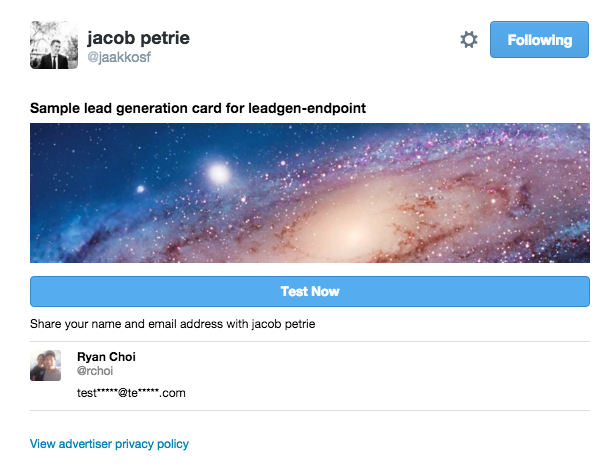

Example Lead Gen Card Endpoint
====================

This is a sample Ruby sinatra app for Twitter lead generation card endpoints.

As always, when developing on top of the Twitter platform, you must abide by the [Developer Agreement & Policy](https://dev.twitter.com/overview/terms/agreement-and-policy). 

Requirements
---------------

On Heroku, this code sample requires [Memcached Cloud](https://devcenter.heroku.com/articles/memcachedcloud) for the cache. You can install
it using the following command:

	`heroku addons:create memcachedcloud`

Alternatively, the Heroku configuration is already available in the `app.json` file.

Once Memcached Cloud has been added, you will notice a three new config vars in your heroku environment containing the 
servers, username and password of your first Memcached Cloud bucket: MEMCACHEDCLOUD_SERVERS, MEMCACHEDCLOUD_USERNAME, MEMCACHEDCLOUD_PASSWORD.

Use the following heroku command to view them:

	`heroku config`
	
For more information on getting this running, visit the [Memcached Cloud Heroku page](https://devcenter.heroku.com/articles/memcachedcloud).

Setup & Configuration
---------------

First, install the sinatra gem:

	`gem install sinatra`

Next, run the app locally with the following command:

	`ruby web.rb`
	
This simply runs the app on your local machine; you likely want this app running on somewhere publically available so that the Twitter servers
can connect to the machine and submit Leads.

One of the easist ways to do so is to deploy this code sample directly to Heroku. The below Heroku instructions will accomplish this:

First, click on the below button to deploy to Heroku:

Creating a Lead Generation Card
---------------

Public Example
---------------

For a working example of both the Twitter Lead Gen Card and the lead data being captured
by a back-end server, go to this live example:

https://limitless-ocean-4365.herokuapp.com/
